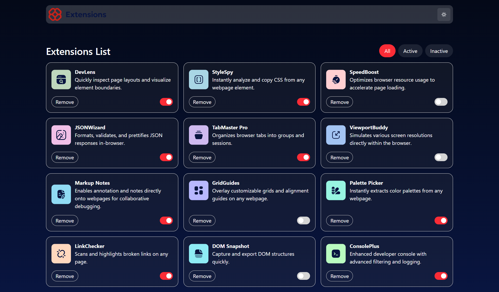
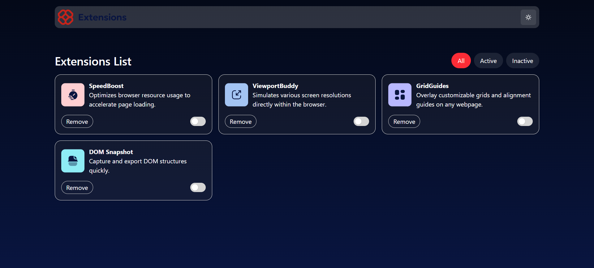

# Frontend Mentor - Browser extensions manager UI solution

This is a solution to the [Browser extensions manager UI challenge on Frontend Mentor](https://www.frontendmentor.io/challenges/browser-extension-manager-ui-yNZnOfsMAp). Frontend Mentor challenges help you improve your coding skills by building realistic projects.

## Overview

### The challenge

Users should be able to:

- Toggle extensions between active and inactive states
- Filter active and inactive extensions
- Remove extensions from the list
- Select their color theme
- View the optimal layout for the interface depending on their device's screen size
- See hover and focus states for all interactive elements on the page

### Screenshot



***removed all active extensions***



### Links

- Solution URL: [solution URL here](https://github.com/molindu/Browser-extensions-manager-UI.git)
- Live Site URL: [live site URL here](https://github.com/molindu/Browser-extensions-manager-UI.git)

## My process

### Built with

- Tailwind css
- Mobile-first workflow
- [React](https://reactjs.org/) - JS library

### What I learned

To see how you can add code snippets, see below:

```js
const [darkMode, setDarkMode] = useState(false);
```
```ts
type FilterBarProps = {
    filter: string;
    setFilter: (filter: string) => void;
    darkMode: boolean;
}
```
```js
const filteredData = extensions.filter(item => {
    if (filter === 'All') return true;
    return filter === 'Active' ? item.isActive : !item.isActive;
});
```
```js
 const bgClass = darkMode
    ? 'bg-neutral-200 text-neutral-900'
    : 'bg-gradient-to-b from-[#040918] to-[#091540] text-white';

```

### Useful resources

- [React with Vite](https://vite.dev/guide/) - I started react with vite 
- [Install Tailwind](https://tailwindcss.com/docs/installation/using-vite) - I used Tailewind for styling.

## Author

- Website - [Molindu Yasoda](https://github.com/molindu/Browser-extensions-manager-UI.git)
